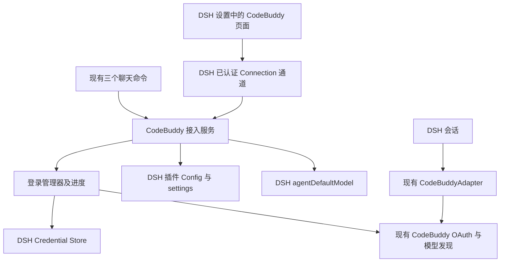

# dsh-codebuddy 配置与接入改造对比方案

**状态**：2026-10-08 已按授权完成本地实施、代码复查、0.2.0-rc.2 Web 与命令环境模拟验收。记录见 MEMORY.md 和 `../verification-0.2.0.md`；真实账号、原生桌面客户端与未来正式版另行验证。未发布或修改用户运行中的 DSH。
**日期**：2026-10-08
**意图**：mid-sized（为已有插件增加原生设置与接入管理功能）
**Goals**：兼容用户指定的 DSH 0.2.0 系列，参照 dsh-codex-subscription 的组织方式，让用户在 DSH 设置中完成 CodeBuddy 登录、查看状态、刷新模型、设置默认模型与推理等级，同时复用既有 CodeBuddy 协议实现。
**目标版本**：当前可获取的验收基线为 `0.2.0-rc.2`；正式 `0.2.0` 发布后须按相同矩阵复验，不将 RC 通过视为未来正式版已经通过。
**生成方式**：task-decomposer；用户最初选择先完成对比方案，随后已授权实施。以下保留原对比依据，实施结果见 `../verification-0.2.0.md`。

## 1. 结论与已验证基线

可以改造。现有项目已经具备 OAuth、凭据持久化、动态模型发现和流式适配，改动应集中在配置、状态管理及 DSH 原生界面的衔接。

| 对象 | 核对结果 |
| --- | --- |
| 本地项目 | `C:/Users/Administrator/Documents/ChatGPT/dsh/dsh-codebuddy`，独立 Git 仓库 |
| 本地版本 | `@lbryany/dsh-codebuddy@0.1.3`，提交 `60bfe09a73793db531a23df4d57c1faf21b63a81` |
| 参考版本 | `dsh-codex-subscription@2.5.5`，提交 `b603165ac22d8d1176be2e582c6edbedebe55df4` |
| 项目开发依赖 | DSH `0.1.6-alpha.2`；这是开发基线，不等于当前运行实例版本 |
| 本机全局安装 | `@deepseek-ai/dsh@0.1.7-alpha.2`；已读取安装包元数据和公开类型，未启动或修改该实例 |
| 目标版本发布核验 | 2026-10-08 查询官方 npm registry：`@deepseek-ai/dsh` 的 `latest/next` 均为 `0.2.0-rc.2`，无不带后缀的 `0.2.0`；不跟随 `0.2.1-alpha.1` |
| 目标宿主能力 | 已直接读取 `0.2.0-rc.2` 发布包的公开类型，确认 `settings.configure/update`、`settings.section`、Connection `/api` 桥、`agentDefaultModel.currentSelection/saveSelection` 可用 |
| 目标 SDK 配套 | 目标 DSH 包使用 Cordis `~4.0.4`、Schemastery `~3.18.4`；官方发布说明的 pi-ai 适配版本为 `0.87.1` |
| 本轮验证 | `npm run typecheck` 通过；`npm test` 的 35 项测试全部通过；未运行会重写 `lib/` 的构建 |

上述 35 项测试仍运行在原开发依赖上，不能据此宣布已兼容 0.2.0；目标发布包目前只做了静态合同核对，尚未安装运行。本轮也没有验证真实账号登录、模型调用或实际运行 profile。实施以 `0.2.0-rc.2` 的 Web 与命令环境为强制验收对象，Windows 桌面端单列安装与界面冒烟验收。`0.1.x` 不作为此次兼容承诺，也不为它引入额外兼容分支；参考项目的兼容声明不能替代本项目验收。

### 0.2.0 适配要求

- 当前 DSH peer/dev 依赖 `^0.1.6-alpha.2` 不覆盖目标版本；必须同时调整 `package.json` 和锁文件，直接开发依赖统一使用精确的 `0.2.0-rc.2`，发布 peer 范围只列实际验收版本。不能只改 README 或放开范围。
- 检查 pi-ai `0.87.1` 的登录、目录、推理参数及事件合同，保留 CodeBuddy 现有协议行为；该依赖当前的 `^0.85.1` 不会自动升级至 `0.87.1`。
- 采用 0.2.0 的 `Config` 可更新字段与 `settings.update(entryId, patch)`；无需为此次目标实现旧 `settings.register` 路径。
- 目录变化使用公开的 adapter registration handle（例如现有 `replace` 路径）。目标 `LlmRuntime.emitAdaptersUpdated` 在声明中是 private，不因为参考项目使用过类似调用就直接依赖它。
- 核对 0.2.0 的 `prepareCall`/模型元数据与实际 stream 的同代一致性；账号变更不能把旧模型能力与新站点凭据混用。仅在现有继承实现无法满足这一合同的地方补适配。
- 前后端导出、DSH client 元数据、浏览器模块加载格式、主题组件和静态资源均以目标发布包为准；Web 验收通过后，桌面端仍需单独核对安装及加载。

## 2. 配置与接入形式对比

| 维度 | 现有 dsh-codebuddy | 参考项目 | 建议 |
| --- | --- | --- | --- |
| 安装组织 | 单个 `cordis.patch.yml` 注册后端；只有服务端导出 | 同一个包声明后端、`./client` 和 `dsh.client` 元数据 | 保持一个安装包，增加浏览器入口和最小客户端依赖 |
| 用户入口 | `/codebuddy-login`、`/codebuddy-status`、`/codebuddy-logout` | DSH 设置页集中管理 | 新增“设置 → CodeBuddy”；命令与界面调用同一服务 |
| 常规配置 | 没有导出的插件 `Config`；部分协议参数由 `PI_CODEBUDDY_*` 环境变量决定 | schema、持久化偏好、变更订阅 | 增加少量用户偏好；协议环境变量继续兼容，不一次性全部搬到界面 |
| 登录过程 | 立即返回授权 URL，后台轮询；重复调用复用正在进行的登录 | 可读取的登录阶段、取消和终态 | 扩展现有登录管理器，保留可读取结果和失败原因 |
| 身份验证协议 | CodeBuddy `auth/state → auth/token` 轮询，随后补充账号信息 | Codex OAuth 与专用接入 | 保留 CodeBuddy 流程，不移植 Codex endpoint、PKCE 或 localhost 回调假设 |
| 凭据 | DSH Credential Store，`CODEBUDDY_OAUTH`，串行修改 | DSH Credential Store，额外提供多账号 vault | 第一阶段保持单账号和原引用，升级后不要求重新登录 |
| 前后端通信 | 无浏览器管理 API | 使用 DSH Connection 的受认证 `/api` 通道 | 增加 CodeBuddy 专属 RPC，仅向界面返回必要的公开状态 |
| 模型来源 | 按环境选择内置目录，合并 `/v3/config` 和企业目录，网络失败保留上次成功目录 | 独立 Codex 账号目录与偏好 | 保留 CodeBuddy 合并规则；显示刷新结果、缓存状态和来源 |
| 默认模型 | 设置页没有入口；由宿主的模型选择流程管理 | 读写宿主 `agentDefaultModel`，保存后读回验证 | 复用同一宿主服务，不另存一份默认模型 |
| 推理等级 | reasoning 模型统一展示七档，默认 `high` | 与模型能力及宿主选项衔接 | 第一阶段统一读写宿主选择；不要声称七档都已逐模型实测 |
| 额度与扩展 | 有流式 token usage 和许可错误处理，没有查到订阅余额查询实现 | 订阅额度、重置卡、搜索、生图等 | 本期不纳入；单次 token usage 不等于订阅剩余额度 |

参考项目的主要价值是分层和交互方式。它的账号、额度、图片、搜索与传输模块含有 Codex 特有逻辑，不适合整体复制。

## 3. 建议的用户流程

设置页保留两个页签，避免为尚未实现的能力增加空页面：

- **账号与连接**：国内站、国际站、自定义站点；发起登录；打开/复制授权链接；等待、取消、重试；查看站点及登录状态；退出。
- **模型与运行**：刷新目录、模型数量、刷新时间、缓存/失败状态；设置新会话默认模型和推理等级。

登录流程：选择站点 → 获取授权链接 → 用户在自己的浏览器授权 → DSH 服务端轮询 → 保存凭据 → 刷新模型 → 界面同步状态。保留复制链接供远程和无头环境使用，不在服务器上强制启动浏览器。

设置页打开时只读取本地账号状态与模型快照，不以一次网络读取失败判定“未登录”。只有登录进行中才定时查询登录进度；终态、组件卸载及连接断开时停止，重新连接后重新取快照。

设置默认模型只影响宿主之后按默认值创建的会话，已有会话不强制切换。设置页和输入框反映同一宿主选择；没有写权限或默认模型服务时明确说明不可保存。

## 4. 建议的内部边界

### 4.1 三种数据分别由其现有所有者保存

| 数据 | 建议所有者 | 约束 |
| --- | --- | --- |
| 默认登录站点 `defaultSite` | 插件 `Config` 的可更新字段，经 `settings.update` 持久化 | 默认仍为国际站；`cn/global/URL` 统一规范化；修改只影响下次登录 |
| 新会话默认模型和推理等级 | 宿主 `agentDefaultModel` | 一次保存完整 `{ provider, model, reasoningEffort }` 并读回确认，禁止建立第二个真值来源 |
| access/refresh token、账号元数据 | 既有 `CODEBUDDY_OAUTH` | 保留原格式和串行写入；不放进 Config、浏览器存储、RPC 响应或支持报告 |
| 登录进度、模型刷新状态 | 服务端内存状态与只读快照 | 短期状态不当作配置；进程重启后从持久凭据重新计算 |
| `PI_CODEBUDDY_*` 协议参数 | 既有运行参数入口 | 第一阶段保持现有优先级、默认值和作用范围 |

当前 `normalizeSite('')` 固定选择国际站。改造后建议：显式命令参数优先，其次持久化 `defaultSite`，最后国际站；没有新配置时保持旧行为。存有国内站凭据时，改默认站点不应把已有 token 发到国际站。

针对目标 `0.2.0-rc.2`，采用公开 `Config` 可更新字段、`settings.configure({auto:false})` 和 `settings.update(entryId, patch)`，不引入旧 `settings.register` 兼容分支。0.2.0 中无 `settings` 或 `connection` 的命令环境仍可加载核心 provider；Web 能力以可选注入注册，不成为核心加载的硬依赖。

### 4.2 登录与模型刷新必须分开建模

建议登录阶段：`idle → starting → waiting_browser → authenticated | failed | cancelled`；另有 `refreshing_models` 工作状态，但模型刷新失败不会把已经持久化成功的登录改成失败。

快照包含 `loginId`、阶段、站点、授权 URL（仅待授权时）、开始时间、公开错误码。账号状态另含 `hasCredential` 和 `expiresAt`；有凭据不等于服务端已确认仍有效，过期时间也不能代替刷新 token 后的结果。

需要明确处理：

- 同一站点重复登录复用任务；登录中更换站点必须先取消旧任务，禁止返回旧站点 URL 冒充新站点授权。
- 取消、退出及宿主卸载时中止旧操作；用任务编号/世代号避免迟到的状态或模型结果覆盖新状态。
- 退出后不允许正在刷新的凭据重新写回；验证实际凭据写入顺序，必要时在共享服务层增加账号世代检查。
- 保留终态供界面读取。当前代码结束即清空 `active`、错误主要进入 logger，不足以支撑 UI 的失败提示。
- 当前命令会把授权链接写入日志。改造时保留用户可见链接，常规日志只记录阶段，错误文本按 CodeBuddy 错误码映射，避免原样反射敏感响应。

### 4.3 建议的最小 RPC 合同

以下方法名为本项目拟新增合同，不是已经存在的 DSH 内置 API。由 `src/rpc.ts` 在 DSH `/api` 桥注册精确路由，统一校验请求并返回有界公开错误。

| 方法 | 输入 | 输出/效果 |
| --- | --- | --- |
| `codebuddy/status` | 空 | 账号、当前登录与目录状态快照，不读取原始 token 给客户端 |
| `codebuddy/login/start` | `site` | `loginId`、授权 URL、阶段 |
| `codebuddy/login/status` | `loginId` | 当前进度或终态 |
| `codebuddy/login/cancel` | `loginId` | 取消指定登录 |
| `codebuddy/logout` | 空 | 取消活动登录、清除原凭据、使目录状态失效 |
| `codebuddy/models/refresh` | 空 | 目录快照、来源、更新时间、是否缓存、错误码 |
| `codebuddy/preferences/status/update` | 空或 `defaultSite` patch | 有效配置、可写性、保存结果 |
| `codebuddy/default-model/status/select` | 空或 `model`、可选 `reasoningEffort` | 宿主默认选择及保存后读回结果 |

用户操作入口不注册为可由模型调用的 tool。浏览器只处理 DSH RPC 和授权链接，不直接请求 CodeBuddy token 接口；沿用宿主 Host/Origin 与浏览器会话认证，不开独立无认证端口。

### 4.4 模型目录和推理等级的保留规则

`src/codebuddy.ts` 的环境判定、Cloud Product 合并、企业覆盖、静态备用目录与网络失败保留策略已经有测试，不在本期重写。新增目录状态时必须依据本次实际执行分支记录 `source`；需要时扩展返回的元数据，不从“存在模型”推断“远端已验证”。

未登录时可保留原目录预览，但明确标示需要登录；不显示“账号可用 N 个模型”。默认模型写入只接受当前已登录目录中的模型；当目录刚刷新失败时禁用新的保存操作，保留已有宿主默认值和缓存浏览能力。

现有七档推理选择是适配器能力声明，不构成每个模型均支持七档的服务端证据。本期保持协议映射，非 reasoning 模型不显示推理选项；模型切换时采用该模型默认档，避免沿用不适用值。若以后 CodeBuddy 目录提供档位元数据，再独立增加逐模型约束，不照搬 Codex 档位表。

## 5. 实施步骤

**输出范围**：先将依赖与适配器公共合同迁至 DSH 0.2.0，再修改 `src/index.ts`、`src/login.ts`、必要的 `src/adapter.ts`/`src/credential-store.ts`；新增服务、RPC、设置与浏览器入口；更新构建、包元数据、锁文件、README 和对应测试。`src/codebuddy.ts` 仅允许必要的 SDK 签名适配及真实目录来源元数据出口，不改变协议及目录合并行为。
**硬边界**：只改本插件。第一阶段不做多账号池、额度查询/重置、生图、搜索 provider、WebSocket、云端压缩、自动 fallback 到别的计费路由、模型隐藏配置或 DSH 全局升级。请求协议不切换成 Codex。
**执行规则**：每步通过后形成独立提交；失败先修复本步，不开始依赖它的下一步。回滚按后完成先撤销的顺序 `git revert <对应步骤提交>`，不重置用户其他改动。每步预计半天至一天，真实 OAuth 验证取决于账号登录配合。
**命令说明**：除已验证的 `typecheck/test` 外，以下新测试文件和验证脚本由对应步骤创建，当前尚不存在；它们是未来验收合同。

### Step 1: 建立 DSH 0.2.0 的依赖与适配器基线

**MUST DO**：
- 将 `package.json`、锁文件、构建 external 和直接开发依赖对齐 `0.2.0-rc.2`；核对并测试 Cordis `4.0.4`、Schemastery `3.18.4`、pi-ai `0.87.1`。只使用实际公开 API。
- 核对 `src/index.ts`、`src/adapter.ts`、`src/credential-store.ts`、`src/codebuddy.ts` 的 SDK 签名和类型，做必要兼容修改；不改变 provider id、CodeBuddy 网络协议或凭据格式。
- 新增 `test/host-contract.test.ts`，覆盖目标 SDK 的注册/释放、目录更新、取消、工具调用与 token usage 事件；覆盖模型预解析后账号发生变化时拒绝混用或使用同代快照的行为。

**MUST NOT DO**：不升级本机全局 DSH；不混装 0.1.x 与 0.2.x 宿主 SDK 掩盖类型错误；不用 private `emitAdaptersUpdated` 或 any 强转跳过兼容问题；不新增设置 UI。
**Acceptance Command**：`npm run check`；`npm ls @deepseek-ai/cordis @deepseek-ai/dsh-llm @deepseek-ai/dsh-commands @deepseek-ai/dsh-credentials @earendil-works/pi-ai`。
**Expected**：原 35 项行为测试和新合同测试在目标依赖上通过；构建通过；依赖树无 invalid peer，直接 DSH 依赖均为 `0.2.0-rc.2`；原命令和 stream 合同仍可演示。
**Rollback**：`git revert <step-1-commit>` 后按恢复的锁文件 `npm ci`；不涉及用户运行环境或凭据迁移。

### Step 2: 让登录状态成为界面和命令共用的能力

**MUST DO**：
- 增加 `src/service.ts`，统一登录、退出、只读账号快照与模型刷新；三个命令改用同一实例。
- 扩展 `src/login.ts` 的阶段、终态、取消和站点复用规则；提供稳定错误码。以最小元数据出口记录真实目录刷新来源。
- 新增 `test/service.test.ts`，扩展 `test/login.test.ts`：覆盖取消、换站点、刷新失败但凭据已保存、退出后的迟到结果、重复登录及模块释放。

**MUST NOT DO**：不改 CodeBuddy endpoint、请求头/envelope 和模型合并算法；不改 `CODEBUDDY_OAUTH` 格式；不新增 UI 硬依赖。
**Acceptance Command**：`npm run typecheck`；`npm test`。
**Expected**：原 35 项测试保留通过，新状态用例全部通过；三个命令维持可用，错误无需查看后台日志才能知道；没有成功退出后凭据复活。
**Rollback**：单独提交该步，使用 `git revert <step-2-commit>`；持久凭据格式不变，无迁移回滚。

### Step 3: 增加持久配置和 DSH 管理 API

**MUST DO**：
- 增加 `src/settings.ts`、`src/rpc.ts`、`src/contract.ts`，在 `src/index.ts` 注册 `Config` 和可选 Web 能力。
- 为 `0.2.0-rc.2` 的 settings 与 Connection API 接线；读取实际 entry id；区分不可写、保存冲突和网络错误。
- 新增 `test/settings.test.ts`、`test/rpc.test.ts`：覆盖偏好持久化、显式 site 优先级、非法 payload、凭据字段不外泄、路由释放与无 Web 宿主启动。

**MUST NOT DO**：不在项目目录写 token 配置文件；不直接操作用户运行中的 profile；不引入独立 HTTP 服务；不伪造保存成功。
**Acceptance Command**：`node --test test/settings.test.ts test/rpc.test.ts`；`npm run typecheck`；`npm test`。
**Expected**：配置保存后重建服务可读回；只读宿主返回不可保存；管理接口只接受合同字段；缺少 Web 服务时原命令和模型适配器仍加载。
**Rollback**：`git revert <step-3-commit>`。新增 `defaultSite` 采用可缺省字段，回退不删除已有凭据；集成测试只写临时 profile。

### Step 4: 交付可以完成登录的原生设置页

**MUST DO**：
- 新增 `src/client.tsx` 和 `src/client/account.tsx`，通过 `settings.section` 注册 CodeBuddy；使用宿主组件、主题和本地化机制。
- 在 `package.json` 声明 `./client`、`dsh.client` 及实际依赖；在 `tsdown.config.ts` 增加独立浏览器构建，在 `tsconfig.json` 纳入 TSX。
- 设置页完成选站点、授权链接、轮询、取消、退出、错误重试；断线重连和多次挂载不会重复启动任务或残留定时器。
- 创建 `test/client-account.test.tsx` 与 `npm run test:ui`，用模拟管理接口验证用户交互与迟到响应处理。

**MUST NOT DO**：不在客户端 bundle 中引入 Node crypto/fs 或凭据代码；不复制参考项目生图/额度组件；不要求服务器安装浏览器。
**Acceptance Command**：`npm run test:ui`；`npm run check`。
**Expected**：未登录、等待授权、已登录、超时、取消及刷新失败均有对应界面；关闭页面释放轮询；浏览器产物按 DSH 加载器格式注册，旧命令仍通过测试。
**Rollback**：`git revert <step-4-commit>`，移除 client 导出与 bundle；Step 3 的后端管理能力仍可单独保留。

### Step 5: 接通目录与默认模型设置

**MUST DO**：
- 新增 `src/default-model.ts`、`src/client/models.tsx` 及 `test/default-model.test.ts`；设置页展示目录来源、刷新结果，并读写宿主默认模型服务。
- 保存 `{provider:'codebuddy', model, reasoningEffort}` 后读回，校验选择属于当前账号目录；更换模型时使用该模型默认推理档位。
- 只在实际需要时调整 `src/adapter.ts` 的目录更新通知；保留 provider id、原文本能力声明、流式事件和工具调用转换。

**MUST NOT DO**：不另存 `defaultModel`/`defaultReasoning` 到插件配置；不把 token usage 画成订阅余额；不修改已有会话当前模型；不猜测模型权限或逐模型七档支持情况。
**Acceptance Command**：`node --test test/default-model.test.ts test/adapter.test.ts`；`npm run test:ui`；`npm run check`。
**Expected**：保存并重建宿主后新会话使用所选模型/档位；已有会话不变；非 reasoning 模型无档位控件；过期目录或只读宿主不会出现虚假的保存成功。
**Rollback**：`git revert <step-5-commit>`；保留宿主已选择的有效模型值，回滚代码不自动覆盖用户选择。

### Step 6: 完成 0.2.0 打包与隔离宿主验收

**MUST DO**：
- 新增 `scripts/verify-dsh.mjs`、`test/delivery.test.ts`，扩展 CI，更新 README 的安装、设置登录及命令兼容说明；提交可复现的 `lib/`。
- 验证脚本实现 `--version <版本>`、`--mode web|commands`、`--mock-provider` 参数；创建独立临时 DSH_HOME/profile、安装本地构建包，以 mock provider 驱动浏览器闭环并输出断言结果。
- 在 `0.2.0-rc.2` 的 Web 与命令 profile 分别验收：设置加载、宿主认证、登录→选模型→模拟对话→重启恢复→退出，以及三个原命令。不得以旧 0.1.x 测试通过替代。
- Windows 桌面版 `0.2.0-rc.2` 使用隔离用户数据目录做安装、设置页加载和登录入口冒烟验收，记录安装产物版本与截图；桌面运行条件不足时明确标记未验证，不宣布桌面兼容。桌面实测前确认隔离启动方式，禁止使用真实默认用户目录。
- 真实账号验收另行进行一次用户浏览器授权和最小模型请求，报告与 mock 分开；必须在实施获准后进行，不属于本轮对比。

**MUST NOT DO**：不使用、重启或覆盖用户现有 profile；不从真实凭据库复制 token 到测试；不自动发布 npm/GitHub；不把 mock 通过写成真实接入验证。
**Acceptance Command**：`npm run check`；`npm run test:ui`；`npm pack --dry-run --ignore-scripts --json`；`node scripts/verify-dsh.mjs --version 0.2.0-rc.2 --mode web --mock-provider`；`node scripts/verify-dsh.mjs --version 0.2.0-rc.2 --mode commands --mock-provider`。
**Expected**：前述命令 exit 0；包包含 host/client/patch/README 且无凭据；无认证管理请求被拒绝；隔离宿主闭环断言通过。桌面验收另外记录“包安装成功、CodeBuddy 设置可见、登录链接出现、关闭重开后配置恢复”四项逐项 pass/fail；真实调用未执行时明确标注“未验证”。
**Rollback**：`git revert <step-6-commit>`；验证脚本关闭自己启动的进程，只清理经路径校验属于本次测试的临时目录，不触碰用户 DSH_HOME。

## 6. 后续可选项与实施前应确认的事实

- **运行 profile**：用户已指定目标为 0.2.0；本机全局 0.1.7 仅是现状。实际使用的 Web/桌面实例及 profile 尚未确定，开始部署验证前读实际环境；不直接假定名为 `web`，也不改成针对本机旧版验收。
- **正式版跟进**：当前 registry 尚无无后缀的 `0.2.0`。将来正式版发布并准备交付时，固定该精确版本重新安装依赖和执行上述验收，再扩展兼容声明；本文不创建自动升级或监控任务。
- **账号额度**：目前代码中未找到可直接复用的余额/重置 API。若希望对齐参考项目的额度卡片，需要单独确认 CodeBuddy 官方/实际响应合同；不以模型调用用量推算余额。
- **多账号与隐藏模型**：参考项目有这些功能，当前请求没有要求纳入。先完成单账号闭环；追加时单独设计缓存隔离与凭据迁移。
- **图片/搜索/Fast**：当前适配器仅声明文本输入；这些能力需要各自协议和验收，不随设置页改造自动获得。
- **UI 效果验证**：本轮只读取源码与类型并运行现有测试，未打开参考插件或目标插件的运行界面。

## 7. 依据与定位

本地源码均对应本轮基线提交，便于后续执行者复核：

- [入口、现有命令及站点规范化](C:/Users/Administrator/Documents/ChatGPT/dsh/dsh-codebuddy/src/index.ts:15)
- [现有登录管理器](C:/Users/Administrator/Documents/ChatGPT/dsh/dsh-codebuddy/src/login.ts:91)
- [CodeBuddy OAuth 与账号元数据](C:/Users/Administrator/Documents/ChatGPT/dsh/dsh-codebuddy/src/codebuddy.ts:1395)
- [CodeBuddy 模型目录与备用规则](C:/Users/Administrator/Documents/ChatGPT/dsh/dsh-codebuddy/src/codebuddy.ts:1865)
- [DSH 模型与推理档位适配](C:/Users/Administrator/Documents/ChatGPT/dsh/dsh-codebuddy/src/adapter.ts:123)
- [凭据串行读写](C:/Users/Administrator/Documents/ChatGPT/dsh/dsh-codebuddy/src/credential-store.ts:5)
- [参考项目固定版本：包声明](https://github.com/WSL043/dsh-codex-subscription/blob/b603165ac22d8d1176be2e582c6edbedebe55df4/package.json)
- [参考项目固定版本：设置兼容层](https://github.com/WSL043/dsh-codex-subscription/blob/b603165ac22d8d1176be2e582c6edbedebe55df4/src/settings-adapter.js)
- [参考项目固定版本：管理通道](https://github.com/WSL043/dsh-codex-subscription/blob/b603165ac22d8d1176be2e582c6edbedebe55df4/src/subscription-transport.js)
- [参考项目固定版本：登录状态协调](https://github.com/WSL043/dsh-codex-subscription/blob/b603165ac22d8d1176be2e582c6edbedebe55df4/src/login-coordinator.js)
- [参考项目固定版本：默认模型服务](https://github.com/WSL043/dsh-codex-subscription/blob/b603165ac22d8d1176be2e582c6edbedebe55df4/src/default-model.js)
- [参考项目固定版本：客户端设置注册](https://github.com/WSL043/dsh-codex-subscription/blob/b603165ac22d8d1176be2e582c6edbedebe55df4/src/client.jsx)
- [DSH 0.2.0-rc.2 官方发布说明](https://github.com/deepseek-ai/deepseek-harness/releases/tag/dsh-v0.2.0-rc.2)
- [DSH 官方 npm 包与版本](https://www.npmjs.com/package/%40deepseek-ai/dsh?activeTab=versions)
- [目标 Settings 发布包元数据](https://registry.npmjs.org/@deepseek-ai%2Fdsh-settings/0.2.0-rc.2)
- [目标 LLM 发布包元数据](https://registry.npmjs.org/@deepseek-ai%2Fdsh-llm/0.2.0-rc.2)
- [目标凭据服务发布包元数据](https://registry.npmjs.org/@deepseek-ai%2Fdsh-credentials/0.2.0-rc.2)

如后续直接复用参考项目源码，应保留对应 MIT 许可与版权声明；本方案目前只借鉴其模块边界和接入方式。
